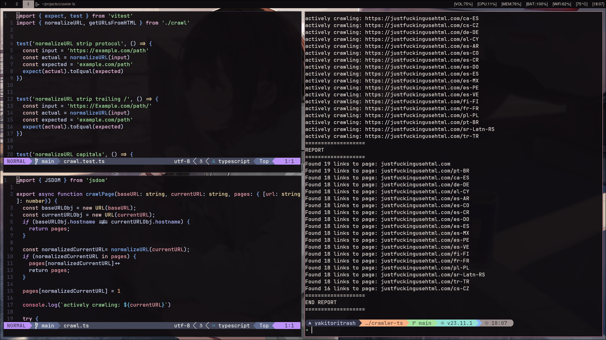
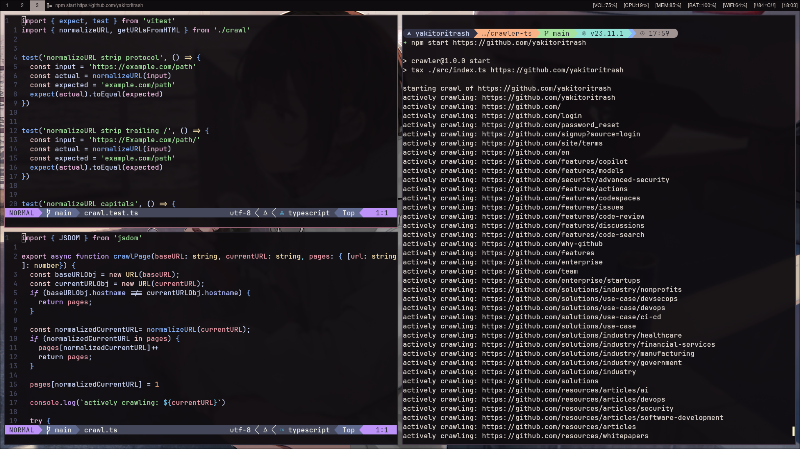

# crawler-ts

A simple web crawler CLI written in TypeScript.

## Overview

**crawler-ts** is a command-line tool that recursively crawls a website, collecting and reporting all unique internal links. The crawler only processes HTML pages on the same domain as the provided base URL. After crawling, it generates a summary report of the discovered links and how often each page was referenced.

## Features

- Recursively crawls all HTML pages within the same domain.
- Ignores non-HTML responses and external links.
- Normalizes URLs to prevent duplicate crawling.
- Generates a report of all pages found and the number of times each was linked.
- Well-tested core logic using [Vitest](https://vitest.dev/).

## Usage

```bash
npm install
npm run build    # or use tsc if TypeScript is installed globally

# Run the crawler with a base URL:
node dist/index.js <website-url>
```

Example:
```bash
node dist/index.js https://example.com
```

## Sample Output

```
===================
REPORT
===================
Found 5 links to page: example.com/
Found 2 links to page: example.com/about
Found 1 links to page: example.com/contact
===================
END REPORT
===================
```

## Screenshots

 
 

## Project Structure

- `src/index.ts` — CLI entry point, argument parsing, and crawl start.
- `src/crawl.ts` — Core crawling, normalization, and link extraction logic.
- `src/report.ts` — Report generation and sorting.
- `src/crawl.test.ts` — Unit tests for crawling logic.
- `src/report.test.ts` — Unit tests for reporting logic.

## Testing

This project uses [Vitest](https://vitest.dev/) for testing.

```bash
npm install
npm test
```

## Dependencies

- [`jsdom`](https://www.npmjs.com/package/jsdom): For parsing HTML and extracting links.
- [`vitest`](https://www.npmjs.com/package/vitest): For running tests.

## Contributing

Pull requests and issues are welcome!

## License

MIT
